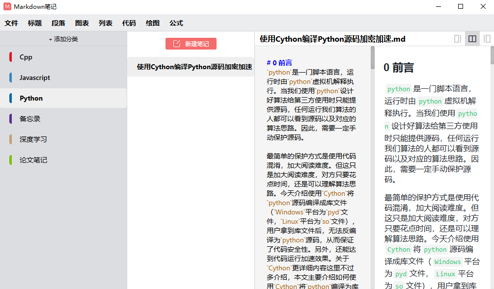

# Markdown笔记


Markdown笔记是基于WinJS([https://winjscode.github.io/](https://winjscode.github.io/))开发的一款windows平台上运行的笔记软件，您可以非常方便的使用markdown来记录笔记。

《Markdown笔记》软件非常小，只有2.4M，支持**公式、流程图、时序图**等。

## 1. 使用预编译好的可执行文件
将[dist/wjs_build](dist/wjs_build)目录下载到本地，然后直接双击《Markdown笔记.exe》即可。

## 2. 手动编译
### 2.1 环境准备
```
node  v18.10.0
npm   8.19.2
```
执行`npm install .`
### 2.2 编译typescript代码
```
npm run build
```
### 2.3 调试
执行如下命令：
```
npm run run
```
执行以上代码后，可以直接运行软件
### 2.4 打包
执行如下代码
```
npm run pkg
```
然后再dist目录下会生成wjs_build目录，该目录里面保存了最终打包的软件。

## 3 第三方软件
本软件引用了[ScreenCapture](https://github.com/xland/ScreenCapture)作为截图功能